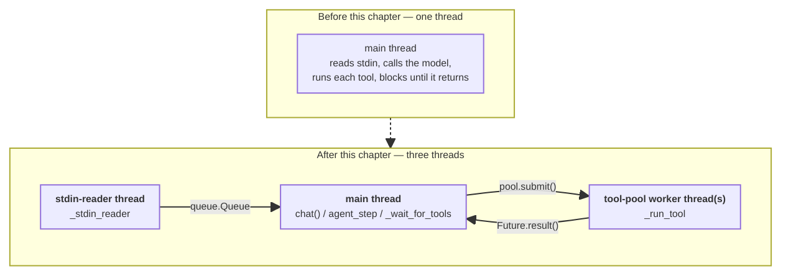
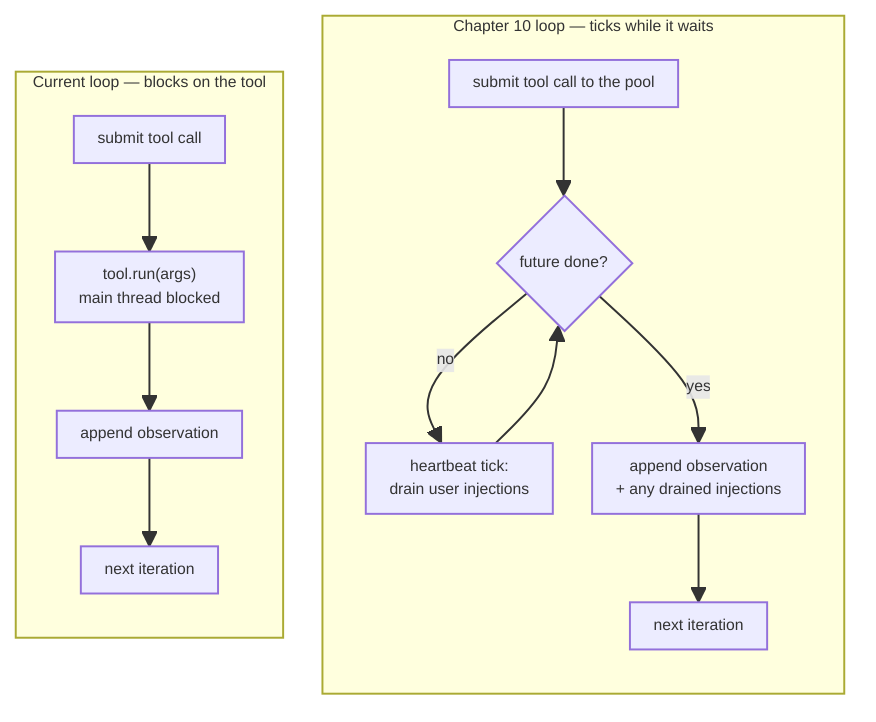
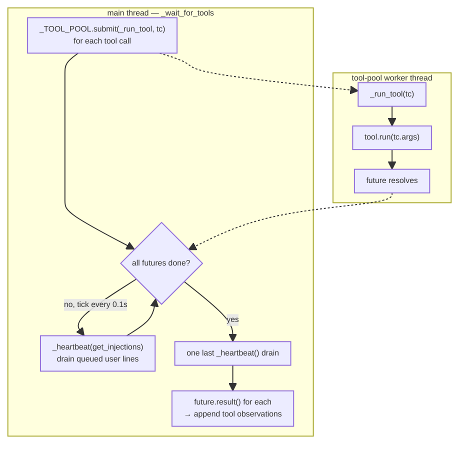
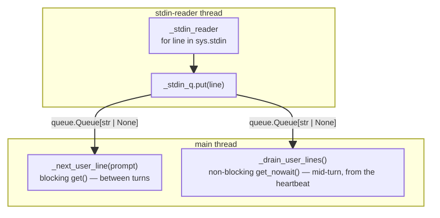

# Chapter 10: Heartbeat & Long-Running Tasks

Chapter 9 handled explicitely handled exists in the loop. Still, the loop assumes that no time passes between iterations. 

Here, the single main thread from every previous chapter splits into three by the end of this chapter: one thread stays in charge of the model and the conversation, and two more run underneath it, each with a narrow job:



## The shape of "time passing"

Today the main loop waits for a tool to finish before doing anything else. That is fine when tools are cheap, like the currently implemented `now()` and `wordcount`. In a real agent a tool call can take anywhere between seconds and minutes. While any of those runs the loop is blocked: the main thread is sitting inside `tool.run(args)`, the user sees a black terminal with no feedback, and there is no way to interrupt the model.

To illustrate the problem, add a deliberately slow tool to `agent/tools/tools.py`. The `sleep_for` tool does nothing but call `time.sleep` and return a string describing how long it waited:

```python
import time

def _sleep_for(args: dict) -> str:
    seconds = float(args["seconds"])
    time.sleep(seconds)
    return f"slept for {seconds:.1f}s"
```

Wire it into the registry the same way as the existing tools:

```python
from tools.tools import _now, _wordcount, _sleep_for

TOOLS: list[Tool] = [
    # now and wordcount tools

    Tool(
        name="sleep_for",
        description="Sleep for the given number of seconds (useful for simulating long-running work).",
        schema={
            "type": "object",
            "properties": {"seconds": {"type": "number"}},
            "required": ["seconds"],
        },
        run=_sleep_for,
    )
]
```

Start a chat and ask the model to wait and then greet:

```text
chat — Ctrl-D or empty line to exit

you: wait thirty seconds and then say hello.

assistant: I'll wait thirty seconds for you.
           [ ~30s of silence — sleep_for is running ]
           Hello.

you: ^D
```

In a more complex session this is the failure mode that matters: there is no telling whether the agent is stuck or working, and no way to redirect it without killing the whole turn.

Two components solve the problem. The first is to push tool calls onto a background thread so the main loop stays responsive while they run. The second is to give the user a way to inject text during the wait — a correction, an update, a redirect — that the agent will see on its next iteration.

Side by side, the shape of the change is a single blocking step turning into a small loop of its own:



The rest of this section builds toward that right-hand shape.

## Run tools off the main thread

Python's standard library ships a thread pool, `concurrent.futures.ThreadPoolExecutor`, which is the simplest off-the-shelf fix for a blocking tool. Each tool call is submitted as a job, returning a `Future` handle, and the executor runs the job on a worker thread. The main thread is now free to do other work — like poll for external events — while the future is pending. When the worker finishes, `future.result()` returns the same string the tool would have produced on the main thread.

Declare the pool once at module scope in `agent/loop.py`, alongside the existing constants:

```python
import concurrent.futures

_TOOL_POOL = concurrent.futures.ThreadPoolExecutor(
    max_workers=4, thread_name_prefix="agent-tool",
)
```

Four workers is enough for this toy agent. If the model ever requests a fifth tool in the same turn, the executor queues it. A production agent would expose this in a config to allow flexibility.

The `thread_name_prefix` keeps the threads visible. They show up under that prefix in `ps`, in `py-spy` output, and in any logging wired up later. Naming threads after the subsystem that owns them is the cheapest investment in future debugging available.

The tool-execution body inside `agent_step` currently looks like this (showing only the fragment about to be replaced):

```python
for tc in reply.tool_calls:
    tool = find_tool(tc.name)
    if tool is None:
        observation = f"Error: no tool named {tc.name!r}."
    else:
        try:
            observation = tool.run(tc.args)
        except Exception as exc:
            observation = f"Error: {type(exc).__name__}: {exc}"
    observation = _truncate_observation(observation)
    messages.append({...})
```

The thread-pool worker expects to receive a tool call and return a string with the result. So this inner part is wrapped into the `_run_tool` helper in `agent/loop.py` next to `_TOOL_POOL`:

```python
def _run_tool(tc) -> str:
    tool = find_tool(tc.name)
    if tool is None:
        return f"Error: no tool named {tc.name!r}."
    try:
        return tool.run(tc.args)
    except Exception as exc:
        return f"Error: {type(exc).__name__}: {exc}"
```

The loop is therefore changes from sequential to submit all, wait for all, collect in order. 

The full rewritten body has the shape below. The wait helper, `_wait_for_tools`, is the loop's heartbeat: it blocks until every submitted future is done, but while it blocks it ticks, draining whatever external events have piled up since the last tick. With no events to drain it would just be a `concurrent.futures.wait(...)` call. 

The diagram below is the system view of this half of the thread split: the tool-pool worker thread on one side just runs the tool and resolves its future, while the main thread's `_wait_for_tools` polls that future in a short loop, and on every pass through the loop — every "tick" — also drains whatever the user typed since the last one:



The tool thread and the polling loop do not talk to each other directly — the worker thread has no idea anyone is ticking, and the tick has no idea whether the tool is close to done. The only shared state is the `Future` object itself, checked with `.done()` on one side and resolved with `.result()` on the other. That decoupling is what keeps `_run_tool` simple: it does not need to know about the heartbeat at all.

```python
futures = [(_TOOL_POOL.submit(_run_tool, tc), tc) for tc in reply.tool_calls]

pending_injections: list[dict] = _wait_for_tools(...)         # defined later in this chapter

for future, tc in futures:
    observation = _truncate_observation(future.result())
    messages.append({
        "role": "tool",
        "tool_call_id": tc.id,
        "name": tc.name,
        "content": observation,
    })

messages.extend(pending_injections)
continue
```

Notice that the futures are submitted before there is anything to do during the wait, and the drained injections are appended after the tool results — so the model sees its own tool batch land first, then the user's interjection, then continues. That ordering matters for the demo at the end of the chapter.

The next three sections build the source of events the heartbeat pulls from, and then come back to wire `_wait_for_tools` up:

## A queue for the user's voice

During a long tool run, a user can type some message to correct the agent's behaviour, direct it in a new way, or ask for an update. Curerntly, user can do this only between the turns.

The following fixes that. Instead of reading stdin from the main thread, a small reader thread runs for the lifetime of the process, consumes every line, and pushes it onto a queue. The main thread then reads from the queue when it wants a prompt.

The reader and queue live alongside the loop, near the top of `agent/main.py`:

```python
import queue
import sys
import threading

_stdin_q: queue.Queue[str | None] = queue.Queue()


def _stdin_reader() -> None:
    for line in sys.stdin:
        _stdin_q.put(line.rstrip("\n"))
    _stdin_q.put(None)


def _start_stdin_reader_once() -> None:
    if getattr(_start_stdin_reader_once, "_started", False):
        return
    threading.Thread(target=_stdin_reader, daemon=True, name="stdin-reader").start()
    _start_stdin_reader_once._started = True  # type: ignore[attr-defined]
```

The queue holds strings or a single sentinel `None` that marks end-of-file (the user closed stdin with Ctrl-D, or the input was piped from a finite file). Marking the thread as `daemon=True` means it does not block process shutdown — when the main thread exits, the reader is torn down. The `_start_stdin_reader_once` guard is for the case where `chat()` is called more than once in the same process.

The queue is read in two places. `_next_user_line` is the prompt-side reader — it replaces the old `input("you: ")` call:

```python
def _next_user_line(prompt: str) -> str | None:
    print(prompt, end="", flush=True)
    line = _stdin_q.get()
    return line
```

And `_drain_user_lines` is the heartbeat-side reader — the function the loop calls to find out what the user typed since the last tick. It pulls everything currently in the queue without blocking and returns the lines:

```python
def _drain_user_lines() -> list[str]:
    lines: list[str] = []
    while True:
        try:
            item = _stdin_q.get_nowait()
        except queue.Empty:
            break
        if item is None:
            continue
        if item.strip():
            lines.append(item.strip())
    return lines
```

The `get_nowait` raises `queue.Empty` rather than blocking, which is what makes the heartbeat fast. The `None` sentinel is ignored mid-turn: end-of-stdin during a turn is information best dealt with when the turn returns, not while the loop is racing to stay responsive.

This is the other half of the thread split from the start of the chapter — the reader thread only ever writes to the queue, and the main thread is the only reader, through one of two entry points depending on whether it wants to block:



## Wiring `chat()` to the queue

The `chat()` rewrite is small. The only changes are starting the reader thread on entry and reading lines through `_next_user_line` instead of `input`:

```python
def chat(provider: Provider | None = None) -> None:
    """Run an interactive chat loop, dispatching each user turn to the agent loop."""
    if provider is None:
        provider = DEFAULT_PROVIDER

    _start_stdin_reader_once()                              # <-- new

    system = build_context()
    messages: list[dict] = []
    print("chat — Ctrl-D or empty line to exit\n")
    while True:
        line = _next_user_line("you: ")                     # <-- replaces input()
        if line is None:                                    # EOF: stdin closed
            print()
            break
        user_input = line.strip()
        if not user_input:
            break

        # the agent_step dispatch and the except block from Chapter 9
        # stay as they are — we will come back to one line of this
        # in the next section to wire injections in
```

`queue.Queue.get()` on the main thread is not interruptible by `KeyboardInterrupt` on every platform — it blocks inside a C-level lock. The Chapter 9 outer `except KeyboardInterrupt` around `input()` therefore stops working as written; pressing Ctrl-C at an idle prompt may not do anything until a line arrives. The cleanest way to keep Ctrl-C-at-prompt working is to use a short timeout and retry, treating the loop as polled:

```python
def _next_user_line(prompt: str) -> str | None:
    print(prompt, end="", flush=True)
    while True:
        try:
            return _stdin_q.get(timeout=0.5)
        except queue.Empty:
            continue
```

Now the `get(timeout=0.5)` releases the GIL every half-second and the main thread becomes interruptible by Ctrl-C. The user sees the same behaviour as before with a half-second responsiveness budget.

## Draining mid-turn

The heartbeat is the moment in the loop where queued user lines are consumed and each one is turned into a message the model will see. It fires at two distinct points in a turn: during the tool-wait while a tool is still running, and between iterations just before the next provider call.

`_wait_for_tools` is called from inside `agent_step`, which lives in `agent/loop.py`. `_drain_user_lines` lives in `agent/main.py` because it is part of the stdin transport. If `loop.py` imported `_drain_user_lines` from `main.py` the result would be a circular import — `main.py` already imports `agent_step` from `loop.py` — and, more importantly, the agent loop would now know how the user talks to it. The loop should not care where user lines arrive from. 

So `_heartbeat` and `_wait_for_tools` live in `agent/loop.py`, and they take the drain function as a parameter. 

The two helpers in `agent/loop.py`:

```python
import time

def _heartbeat(get_injections: Callable[[], list[str]] | None) -> list[dict]:
    if get_injections is None:
        return []
    return [
        {"role": "user", "content": f"[mid-turn user note] {line}"}
        for line in get_injections()
    ]


def _wait_for_tools(
    futures: list,
    get_injections: Callable[[], list[str]] | None,
) -> list[dict]:
    pending: list[dict] = []
    while not all(f.done() for f, _ in futures):
        pending.extend(_heartbeat(get_injections))
        time.sleep(0.1)
    pending.extend(_heartbeat(get_injections))          # last drain after the batch finishes
    return pending
```

`_heartbeat` is the thin layer, wrapping each luser line in `{"role": "user", "content": "[mid-turn user note] ..."}`. Defaulting `get_injections` to `None` keeps the loop callable without an input source, which is convenient for tests and scripted runs.

`agent_step` grows one new parameter — the same callback, threaded through — and one new call to `_heartbeat` at the top of each iteration:

```python
def agent_step(
    user_message: str,
    messages: list[dict],
    provider: Provider,
    system: str,
    on_text_delta: Callable[[str], None] | None = None,
    get_injections: Callable[[], list[str]] | None = None,    # <-- new
) -> str:
    messages.append({"role": "user", "content": user_message})

    try:
        for _ in range(MAX_ITERATIONS):
            messages.extend(_heartbeat(get_injections))       # <-- new
            reply: Reply = provider.call(
                messages, system=system, tools=TOOLS, on_text_delta=on_text_delta,
            )
            # --- existing stop_reason / tool_use handling ---
```

The tool-execution body sketched earlier in the chapter now has a place for its second argument:

```python
pending_injections: list[dict] = _wait_for_tools(futures, get_injections)
```


Drained messages are appended in the order they arrived, so a multi-line burst shows up to the model as three sequential user notes. The final injection is the one the model is most likely to act on, which usually matches the user's actual intent.

Finally, `chat()` supplies the drain function — this is the line that connects the input source to the loop:

```python
agent_step(
    user_input, messages, provider, system,
    on_text_delta=lambda delta: print(delta, end="", flush=True),
    get_injections=_drain_user_lines,                          # <-- new
)
```


## Steering a long task

Time for the demo this chapter has been building toward. Start a session and ask for a sleep:

```
chat — Ctrl-D or empty line to exit

you: sleep for thirty seconds and then say "hello"

assistant: I'll sleep for 30 seconds now.
```

The model issues a `sleep_for(30)` tool call. The tool starts running on the pool. The main thread enters `_wait_for_tools`. While the tool runs, type a line at the (now-blank) terminal — without a prompt, just press keys — and hit return:

```
actually skip the sleep, just say hi quickly
```

Nothing visible happens for a second or two. When the tool finishes, the loop appends its observation and the queued injection, then enters the next iteration. The model sees:

```
[user]  sleep for thirty seconds and then say "hello"
[assistant tool_call] sleep_for(seconds=30)
[tool result] slept for 30.0s
[user]  [mid-turn user note] actually skip the sleep, just say hi quickly
```

And the next reply:

```
assistant: Hi! (I already finished the sleep, but noted — I'll skip it next time you ask for a wait.)
```

The model handled the conflict correctly. The sleep was already done by the time the note arrived, so there was nothing to skip, but the note still informed the reply ("noted — I'll skip it next time"). 

## The virtual tool-call pattern

The idea of a virtual tool-call pattern is to expose an intent that the agent harness needs to act on as a tool call with a real schema. The model issues what looks like a tool call; the loop recognises the name, treats the arguments as metadata, and acts on them itself. 

A concrete example is a `wait_until(timestamp)` tool. The model wants to wait for a specific time before checking something — say, "remind me in five minutes" or "wait until 9am." Without a virtual tool, the model has to either say "I'll wait" in free text (which the harness then has to parse) or call a real `sleep_for` tool with a computed delta. With a virtual tool, the model expresses the intent in structured form:

```json
{"name": "wait_until", "args": {"timestamp": "2026-05-13T15:45:00Z", "reason": "user asked to be reminded"}}
```

The loop sees `wait_until`, recognises it as a virtual tool, and handles it specially: register the wait with the heartbeat, return a synthetic observation like `"wait registered: 4m 58s remaining"`, and on the iteration when the timestamp lands, fire a follow-up.

## Production reference

Open [`nanobot/nanobot/heartbeat/service.py`](https://github.com/HKUDS/nanobot/blob/28f9bbff314cf90b0401b3aa220ca7a723c4f4ab/nanobot/heartbeat/service.py). The `HeartbeatService` class is a different beast from the chapter's `_heartbeat` function — it is a *periodic scheduler* that wakes the agent every `interval_s` (default 30 minutes) to check `HEARTBEAT.md` for tasks. The relevant production lessons are not in the scheduling but in two smaller details.

[`_HEARTBEAT_TOOL`](https://github.com/HKUDS/nanobot/blob/28f9bbff314cf90b0401b3aa220ca7a723c4f4ab/nanobot/heartbeat/service.py#L14) near the top of the file is a textbook virtual tool. Its schema (`action`: `skip` or `run`; `tasks`: a string summary) gives the model a structured way to answer "is there anything to do right now?" — without a virtual tool the answer would be free-text, the harness would have to parse it, and there would be a permanent risk of the model saying "yes" in a way the parser missed. The tool call removes the parsing problem entirely. The [`_decide`](https://github.com/HKUDS/nanobot/blob/28f9bbff314cf90b0401b3aa220ca7a723c4f4ab/nanobot/heartbeat/service.py#L87) method shows the round trip: prompt the model, read `response.tool_calls[0].arguments`, branch on the structured `action`. Adopting this for the chapter's own virtual tools — once they are added — is a small change: route the tool name to a harness-internal handler instead of `tool.run`.

The closer cousin of the chapter's `_heartbeat` lives in [`nanobot/nanobot/agent/runner.py`](https://github.com/HKUDS/nanobot/blob/28f9bbff314cf90b0401b3aa220ca7a723c4f4ab/nanobot/agent/runner.py). [`_try_drain_injections`](https://github.com/HKUDS/nanobot/blob/28f9bbff314cf90b0401b3aa220ca7a723c4f4ab/nanobot/agent/runner.py#L142) is what the production loop calls between iterations to pull user messages off an injection callback (the production analogue of the stdin queue here — it might come from a message bus, an HTTP endpoint, or a chat channel). Three details are worth pulling out.

**The cycle cap.** [`_MAX_INJECTION_CYCLES`](https://github.com/HKUDS/nanobot/blob/28f9bbff314cf90b0401b3aa220ca7a723c4f4ab/nanobot/agent/runner.py#L42) (constant near the top of the same file) is the production version of `MAX_ITERATIONS` for injections specifically. Without a cap, an adversarial or unlucky injection callback that produces a new message every time the loop drains would keep the loop alive forever — the model finishes, the heartbeat injects, the model finishes again, the heartbeat injects again, on and on. Capping the cycle count is the same defensive instinct as capping iterations in Chapter 6: any loop whose termination depends on an external producer pausing needs a fuse.

**Adjacent-user merging.** [`_append_injected_messages`](https://github.com/HKUDS/nanobot/blob/28f9bbff314cf90b0401b3aa220ca7a723c4f4ab/nanobot/agent/runner.py#L121) merges a new user injection into the most recent message if that message is *also* a user message, rather than appending it as a separate entry. The reason is structural: Anthropic and OpenAI's APIs both reject conversations with two consecutive user messages without an assistant message between them. The chapter's toy works because the heartbeat fires *after* assistant turns (between iterations and after tool batches), so the message before an injection is always an assistant or tool message. The production loop has more injection sites and has to be defensive.

**The callback shape.** [`_drain_injections`](https://github.com/HKUDS/nanobot/blob/28f9bbff314cf90b0401b3aa220ca7a723c4f4ab/nanobot/agent/runner.py#L186) calls an async callback supplied by the agent's spec. The callback returns whatever new messages exist; it is the producer's responsibility to expose them. This decoupling is the same boundary the chapter's `_heartbeat(get_injections)` uses, just async and slightly more elaborate (the production version invokes the callback with or without a `limit` keyword depending on its signature, which is how nanobot lets producers opt into back-pressure). The decoupling is what lets the same loop code pull injections from a websocket, a polling cron job, or an in-process queue — the heartbeat does not know where injections come from, only how to ask for them. Adding a second event source to the loop (a notification daemon, a scheduled cron tick) is now a one-line change in `chat()`: compose two drain functions into a single callback.

## Exercises

1. **Per-tool timeout.** Extend `_run_tool` to accept a timeout, and have `_wait_for_tools` cancel any future that exceeds it (`future.cancel()` only works on not-yet-started futures, so in-flight ones must either finish in the background or take a `threading.Event` cancel flag passed into the tool — start with the simpler version that returns a `[timed out after Ns]` observation and leaves the thread running). Test with `sleep_for(60)` and a 10-second cap.

2. **Cooperative cancellation.** Modify `sleep_for` to accept a `cancel_event: threading.Event` argument and break out of its sleep loop when the event is set. Have the heartbeat raise a cancel flag when it sees a mid-turn injection that starts with the word `cancel:` (e.g., `cancel: skip this`), and verify that the running tool is interrupted within 100ms instead of running to completion.

3. **Progress callbacks.** Extend the `Tool` dataclass with an optional `on_progress: Callable[[str], None] | None` field. Modify `sleep_for` to call `on_progress(f"slept {n}s of {total}s")` every second. In `_run_tool`, pass a callback that writes the progress line to the terminal (clearing the previous line with `\r`). Run a long sleep and watch the progress update in place.

4. **A virtual `wait_for` tool.** Define a tool named `wait_for` with a schema `{"seconds": float, "reason": string}` and *no* `run` function — instead, have `_run_tool` recognise the name and dispatch to a harness handler that registers the wait with the heartbeat. The handler should: return immediately with `"wait registered: {seconds}s"`, record the wake-up time in a module-level dict, and add a heartbeat branch that injects a synthetic user note (`[wait_for elapsed: {reason}]`) when the wake-up time passes. Demonstrate with `wait_for(seconds=10, reason="check on the build")` followed by a normal chat turn.

5. **Stretch: rewrite the loop in `asyncio`.** Replace `ThreadPoolExecutor` with `asyncio.to_thread`, the stdin reader with a `loop.add_reader` on `sys.stdin`, and the queue with an `asyncio.Queue`. Run the same sleep-then-inject demo. Note where the threading version was clearer and where the async version was clearer. (Hint: the async version handles cancellation more cleanly because `Task.cancel()` actually works mid-execution.)

6. **Stretch: read the injection production code.** The chapter's `get_injections` callback matches the *shape* of nanobot's `injection_callback`, but the production version layers three details on top that the toy skips. Read [`_try_drain_injections`](https://github.com/HKUDS/nanobot/blob/28f9bbff314cf90b0401b3aa220ca7a723c4f4ab/nanobot/agent/runner.py#L142), [`_drain_injections`](https://github.com/HKUDS/nanobot/blob/28f9bbff314cf90b0401b3aa220ca7a723c4f4ab/nanobot/agent/runner.py#L186), and [`_append_injected_messages`](https://github.com/HKUDS/nanobot/blob/28f9bbff314cf90b0401b3aa220ca7a723c4f4ab/nanobot/agent/runner.py#L121) in [`nanobot/nanobot/agent/runner.py`](https://github.com/HKUDS/nanobot/blob/28f9bbff314cf90b0401b3aa220ca7a723c4f4ab/nanobot/agent/runner.py). Pay attention to (a) how the callback is invoked with or without a `limit` keyword via signature inspection, (b) why merging adjacent user messages is necessary (the role-alternation invariant), and (c) what [`_MAX_INJECTION_CYCLES`](https://github.com/HKUDS/nanobot/blob/28f9bbff314cf90b0401b3aa220ca7a723c4f4ab/nanobot/agent/runner.py#L42) defends against. Write a paragraph on which of those three details are worth adopting in an agent now, and which can be deferred until needed.

## References

[1] *`concurrent.futures` — Launching parallel tasks.* Python documentation. <https://docs.python.org/3/library/concurrent.futures.html>

[2] *`queue` — A synchronized queue class.* Python documentation. <https://docs.python.org/3/library/queue.html>

[3] *`threading` — Thread-based parallelism.* Python documentation. <https://docs.python.org/3/library/threading.html>
