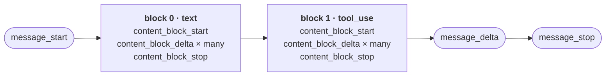
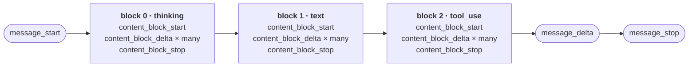

# Chapter 4: Streaming Responses

The `chat()` function in `main.py` waits for the model's full reply before printing anything. However, the model generates tokens one at a time, and the first word is in fact ready within a few hundred milliseconds. 

By the end of this chapter, `llm()` will be a Python generator that yields text deltas as they arrive, `chat()` will render them live, and the system prompt will be marked for prompt caching so the agent is not paying full price to re-process it on every turn.

## Why streaming matters

There are three main advantages of introducing streaming into the application:

1. Without streaming, the user waits for the entire response, whereas streaming allows to see the first word instantly.

2. The CLI tool will only use streaming for display, but agents that route output to other places (Telegram channel, UI with progressive Markdown redering, downstream tool) can act on partial output because of it.

3. With tools, the model emits the tool name first, then the arguments piece by piece. Without streaming, a tool whose arguments are a 2-KB shell command freezes the agent for seconds while the closing brace is awaited. With streaming, the agent can render `calling read_file('notes.txt')...` the moment the function name commits, and the user has a window to hit Ctrl-C to prevent an agent from doing something destructive. 

## How streaming works, mechanically

Streaming is built on server-sent events (SSE) [1], a thin protocol on top of HTTP. The client opens a single long-lived HTTP connection. The server keeps the connection open and writes events to it as they happen. Each event has a name and a JSON data payload, separated by blank lines:

```
event: content_block_delta
data: {"type":"content_block_delta","index":0,"delta":{"type":"text_delta","text":"Hello"}}

event: content_block_delta
data: {"type":"content_block_delta","index":0,"delta":{"type":"text_delta","text":" there"}}
```

Raw SSE can be read with nothing more than a streaming HTTP client. The SDK handles this in the chapter, but it is good to know that it is plain text over an HTTP connection.

Anthropic's stream emits a fixed sequence of event types per response [2]:

| Event | When it fires | What's in it |
|---|---|---|
| `message_start` | Once, at the beginning | Empty message metadata |
| `content_block_start` | Each time a new content block begins | The block's type (`text`, `tool_use`, `thinking`) |
| `content_block_delta` | Many times per block | A small piece of the block's content |
| `content_block_stop` | Each time a block ends | Nothing — just a marker |
| `message_delta` | Near the end | Final `stop_reason`, output token count |
| `message_stop` | Once, at the end | Nothing — just a marker |

The table lists the events flat, but in fact they nest two levels deep: `message_start` and `message_stop`, bracket the entire response. Inside that envelope sit one or more *content blocks*, each one wrapped in its own `content_block_start` / `content_block_stop` pair. The actual text never arrives at the top level; it comes as a run of `content_block_delta` events nested *inside* a block. Just before the envelope closes, a single `message_delta` reports how the whole response ended.

That last event is the one whose name tends to mislead. A `content_block_delta` carries a delta of *content* — a few more characters of text appended to a block. A `message_delta` carries a delta of the *message object* itself: the top-level fields that were still unknown when `message_start` fired. At the start of a response the model cannot yet say why it will stop or how many tokens it will spend, so those fields arrive empty; the single `message_delta` near the end patches them in, setting `stop_reason` (`end_turn`, `max_tokens`, `tool_use`, and so on) and the final output token count on the message. It updates the envelope's bookkeeping once the contents are complete.

The shape is easier to read drawn out. A plain-text reply followed by a tool call produces two block cycles, nested one after the other inside the same message envelope:



The number of blocks varies with the reply. A bare text answer has just block 0 and skips the `tool_use` cycle entirely. Adaptive thinking adds a `thinking` block *before* the text block, so the order becomes thinking, then text, then any tool calls — each one its own start/delta/stop cycle, all of them sandwiched between the single `message_start` at the top and the `message_delta`/`message_stop` at the bottom.

Drawn out, that three-block reply keeps the same envelope, now with the `thinking` cycle leading and the `text` and `tool_use` cycles following in turn:



This chapter uses the SDK's high-level helper, `client.messages.stream()` instead of consuming raw events directly. Under the hood it does three things: it opens the SSE connection and parses the `event:` / `data:` lines back into Python objects, then it routes each event by type into a typed object so there is no need to pattern-match on raw JSON, and finally it accumulates deltas as they arrive so a final `get_final_message()` call can hand back a fully assembled `Message` with `content`, `usage`, and `stop_reason` populated. Doing this by hand is not hard, and stretch Exercise 7 replaces `text_stream` with raw event iteration to expose the underlying machinery. Stretch Exercise 8 goes further and parses the SSE protocol from a raw HTTP stream without the SDK at all.

## Refactoring `llm` into a generator

The simplest possible streaming call looks like this:

```python
with client.messages.stream(
    model="claude-opus-4-6",
    max_tokens=16000,
    messages=[{"role": "user", "content": "say hi"}],
) as stream:
    for text in stream.text_stream:
        print(text, end="", flush=True)
```

`stream.text_stream` is a high-level helper that yields just the text deltas — exactly what the CLI tool needs to render a reply live. (Iterating the stream object directly gives the raw event stream from the table above, which Chapter 7 needs for tool calls, but `text_stream` covers everything in this chapter.)

The `llm` function in Chapter 3 returned the full reply, fetched in one blocking call. It now changes to yield text deltas as they arrive, wrapping `messages.stream(...)` instead of `messages.create(...)`. That makes it a Python generator, and changes its type signature from `-> str` to `-> Iterator[str]`.

A generator is a function that uses `yield` instead of `return`. Calling it does not produce its return value, it produces a generator object that suspends the function's execution at each `yield` and resumes it on the next iteration. Local variables stay alive between yields, so the function effectively pauses mid-flight and picks up exactly where it left off when the caller asks for the next value. PEP 255 [3] is the original specification for the historical motivation.

Add the `Iterator` type to the imports at the top of `main.py`:

```python
from typing import Iterator
```

First, change the return type for the `llm()` function:

```python
def llm(messages: list[dict], system: str = "") -> Iterator[str]:
    """Stream the model's reply, yielding text deltas as they arrive."""
```
Now wrap `client.messages.stream(...)` in a `with` block and yield each delta as it arrives. This way, when the generator is exhausted (or the caller breaks out early), the context manager closes the underlying HTTP connection cleanly. 

```python
def llm(messages: list[dict], system: str = "") -> Iterator[str]:
    """Stream the model's reply, yielding text deltas as they arrive."""
    with client.messages.stream(
        model="claude-opus-4-6",
        max_tokens=1024,
        system=system,
        messages=messages,
    ) as stream:
        for text in stream.text_stream:
            yield text
```


Callers that want the full string get it via `"".join(llm(messages))`. Streaming is the new default but non-streaming is still easy to enable. 

## Updating chat to render live

Inside `chat()`, the single `reply = llm(messages, system=system)` call from Chapter 3 is replaced by a six-line block: print the assistant prefix, iterate the generator while printing each delta and collecting into a list, then append the joined reply to history.

```python
print("\nassistant: ", end="", flush=True)
chunks: list[str] = []
for text in llm(messages, system=system):
    print(text, end="", flush=True)
    chunks.append(text)
print("\n")
messages.append({"role": "assistant", "content": "".join(chunks)})
```

Two details are worth noticing. The `flush=True` argument is mandatory: Python's `print` buffers stdout by default, and without flushing the "live" stream will not appear until the buffer fills or the program exits. And the deltas accumulate in a list, joined at the end rather than built up with `reply += text`, because repeated string concatenation is technically O(n²) in Python. The reason is that strings are immutable: `reply += text` cannot grow the existing buffer in place, so the interpreter allocates a fresh string of length `len(reply) + len(text)`, copies the old contents into it, copies the new chunk on the end, and lets the old string be garbage-collected. A list of chunks plus one final `"".join(chunks)` is O(N) in time and O(N·k) in memory: the list holds N pointers to existing string objects, and `join` allocates the final buffer exactly once. The Python FAQ documents this[5]. 


Run it and notice how the reply now appears word by word instead of arriving as a single block.:

```
$ uv run main.py
chat — Ctrl-D or empty line to exit

you: explain how a hash table works in 150 words

assistant: A hash table stores key-value pairs for fast lookup. It works in three steps:...
```

## Getting the final message after streaming

Streaming produces a stream of text. It does not, by itself, produce the things the non-streaming response did: `usage`, `stop_reason`, the full `content` list. Those are still available because the SDK accumulates them under the hood and exposes them via `stream.get_final_message()`, called after the stream has been consumed:

```python
with client.messages.stream(...) as stream:
    for text in stream.text_stream:
        ...
    final = stream.get_final_message()
    print(final.usage.input_tokens, final.usage.output_tokens)
    print(final.stop_reason)  # "end_turn", "max_tokens", "tool_use", ...
```


## Prompt caching

The application now has a streaming client and a system prompt. Streaming reduced the time it takes to display a reply, but it did not change the time it takes to start generating one: every turn still re-processes the entire system prompt and conversation history. With the small example system prompt assembled from template files from Chapter 3 (a few hundred tokens of Markdown), nothing will change. With real templates (skill files, accumulated memory, instructions), the system prompt will become the dominant cost on every turn.

The Anthropic API charges roughly 10% of the normal input-token rate (0.1×) for cached input, with a one-time write cost of about 1.25× when the cache is first populated [6]. Anthropic reports that long prompts can be served at up to 90% lower cost and 85% lower latency once a cache hit lands [7]. Mechanically, providers implement this by retaining the model's KV cache, which is the per-layer key/value tensors produced when the prefix was first processed. The vLLM team's PagedAttention paper [8] is a good in-depth read on how serving systems manage KV-cache memory across many concurrent requests. Skipping prefill is also why cache reads improve time-to-first-token: there is no work to do before the first generated token comes out.

The mechanics on the Anthropic API are simple. Adding `cache_control={"type": "ephemeral"}` at the top level of the request makes the API automatically cache the last cacheable block of the prefix:

```python
with client.messages.stream(
    model="claude-opus-4-6",
    max_tokens=1024,
    system=system,
    cache_control={"type": "ephemeral"},  # <-- cache added
    messages=messages,
) as stream:
    ...
```

After five minutes of inactivity, the cache entry expires and the next request re-writes it [6]. A 1-hour TTL is also available at a higher 2× write cost, useful for prefixes that get reused across long sessions.

It is worth knowing that caching is a strict prefix match. There is also a minimum cacheable size. For Claude Opus 4.7 it is 4,096 tokens, while smaller models have lower thresholds (Sonnet 4.6 sits at 2,048 tokens and Sonnet 4.5 at 1,024) [6]. If the prefix is shorter, the cache silently does nothing and `cache_creation_input_tokens` returns zero. Adding the flag now is harmless and means the moment the workspace passes the threshold, the agent starts saving money without further code changes.

Verifying that it works comes down to the response's `usage` object, which reports `cache_creation_input_tokens` (tokens written at 1.25×) and `cache_read_input_tokens` (tokens read at 0.1×). After two consecutive requests with the same prefix, the second should report a non-zero `cache_read_input_tokens`. If it does not, something invalidated the cache between the calls, usually a silent timestamp or non-deterministic ordering somewhere in the prefix. Exercise 5 grows the templates directory until the cache kicks in so the difference becomes observable.

## Production reference

In nanobot, the production version of the `llm()` generator is [`chat_stream()`](https://github.com/HKUDS/nanobot/blob/28f9bbff314cf90b0401b3aa220ca7a723c4f4ab/nanobot/providers/anthropic_provider.py#L560) in [`nanobot/nanobot/providers/anthropic_provider.py`](https://github.com/HKUDS/nanobot/blob/28f9bbff314cf90b0401b3aa220ca7a723c4f4ab/nanobot/providers/anthropic_provider.py). Strip away its error handling and what remains is the code just written here: open `messages.stream(**kwargs)` as an async context manager, iterate `text_stream`, hand each delta off, then call `get_final_message()` to recover `usage` and `stop_reason`. The structural difference is that streaming and non-streaming live as two separate methods, `chat_stream()` and [`chat()`](https://github.com/HKUDS/nanobot/blob/28f9bbff314cf90b0401b3aa220ca7a723c4f4ab/nanobot/providers/anthropic_provider.py#L540), that share the same [`_build_kwargs`](https://github.com/HKUDS/nanobot/blob/28f9bbff314cf90b0401b3aa220ca7a723c4f4ab/nanobot/providers/anthropic_provider.py#L416) plumbing, so the request they send is identical; the runner picks between them based on whether the active hook (REPL, Telegram, WebUI) wants live deltas.

As in the previous chapters, a few functions are worth tracing once the chapter's own `llm` is written:

- **[`chat_stream()`](https://github.com/HKUDS/nanobot/blob/28f9bbff314cf90b0401b3aa220ca7a723c4f4ab/nanobot/providers/anthropic_provider.py#L560)** is the async equivalent of the generator built here. Instead of `yield`, it pushes each delta into an [`on_content_delta`](https://github.com/HKUDS/nanobot/blob/28f9bbff314cf90b0401b3aa220ca7a723c4f4ab/nanobot/providers/anthropic_provider.py#L569) callback supplied by the runner. A callback fits when one stream feeds several consumers at once (REPL, Telegram, observability); a generator fits a single caller pulling values one at a time.
- **[`_apply_cache_control()`](https://github.com/HKUDS/nanobot/blob/28f9bbff314cf90b0401b3aa220ca7a723c4f4ab/nanobot/providers/anthropic_provider.py#L379)** is the production version of the single `cache_control={"type": "ephemeral"}` line added here. It marks more than the system prompt: it walks the messages list and the tools list and places markers at each of the four allowed cache breakpoints, so a tool catalog and a long conversation tail are cached independently. The [`_tool_cache_marker_indices`](https://github.com/HKUDS/nanobot/blob/28f9bbff314cf90b0401b3aa220ca7a723c4f4ab/nanobot/providers/base.py#L233) helper on the base class chooses where the breakpoints go; Chapter 7 returns to why the tool catalog is worth caching.
- **[`chat_stream_with_retry()`](https://github.com/HKUDS/nanobot/blob/28f9bbff314cf90b0401b3aa220ca7a723c4f4ab/nanobot/providers/base.py#L527)** in [`nanobot/nanobot/providers/base.py`](https://github.com/HKUDS/nanobot/blob/28f9bbff314cf90b0401b3aa220ca7a723c4f4ab/nanobot/providers/base.py) wraps `chat_stream` with retry-on-transient-failure logic. Streaming makes retries delicate: by the time a connection drops mid-reply, the first deltas are already on the user's screen, so the policy must decide whether to restart the turn or live with a truncated one.

One safeguard is invisible from a toy script: the idle timeout. Each `__anext__()` on the stream iterator is wrapped in [`asyncio.wait_for(..., timeout=idle_timeout_s)`](https://github.com/HKUDS/nanobot/blob/28f9bbff314cf90b0401b3aa220ca7a723c4f4ab/nanobot/providers/anthropic_provider.py#L582) — 90 seconds by default, set by [`NANOBOT_STREAM_IDLE_TIMEOUT_S`](https://github.com/HKUDS/nanobot/blob/28f9bbff314cf90b0401b3aa220ca7a723c4f4ab/nanobot/providers/anthropic_provider.py#L575). A half-open TCP connection would otherwise hang the agent indefinitely, since the SDK imposes no timeout of its own.

## Exercises

1. **Time to first token vs. total time.** Add timing around the `llm` generator: record the time at the start, the time when the first chunk arrives, and the time when the loop finishes. Print all three. Compare to the non-streaming version of `llm` (Chapter 3): the *total* time is roughly the same, but the *first-token* time is much shorter. That gap is the perceived-latency improvement.

2. **Disable `flush=True`.** Remove `flush=True` from the `print` call inside `chat`. Watch what happens. The stream is still arriving, but Python's stdout buffering hides it until the buffer fills or the program exits. This is a useful thing to have seen; it is also a footgun a lot of people hit at least once.

3. **Get the final message.** Modify `chat` to call `client.messages.stream(...)` directly (not via the `llm` generator) for one turn, so that `stream.get_final_message()` can be called to inspect the result. Print `final.usage` and `final.stop_reason`. Confirm the `stop_reason` is `end_turn` for normal replies. Chapters 7 and 9 need this.

4. **Watch the cache.** Add `cache_control={"type": "ephemeral"}` to the stream call (it is already there in `main.py`). Modify `llm` (or the inline version from Exercise 3) to print `final.usage.cache_creation_input_tokens` and `final.usage.cache_read_input_tokens` after every turn. Run a 5-turn conversation and watch the numbers — most likely both will be zero, because the workspace is below the 4K minimum. That is expected; the next exercise fixes it.

5. **Force a cache hit.** Pad the workspace with a long Markdown file — a copy of an article, a code reference, anything that brings the system prompt above ~5,000 tokens. Re-run the conversation. The first turn should report a non-zero `cache_creation_input_tokens`; every subsequent turn (within five minutes) should report `cache_read_input_tokens` close to that number, with `input_tokens` (uncached) close to zero. The cost of the system prompt is now down to ~10% of the original.

6. **Stretch: Cancel a stream.** Wrap the `for text in stream.text_stream` loop in a try/except for `KeyboardInterrupt`. When the user hits Ctrl-C, break out cleanly, append the partial reply to `messages`, and return to the input prompt. This is a small piece of "the agent can be interrupted" UX that real assistants need; Chapter 9 treats it more carefully.

7. **Stretch: Raw events.** Replace `stream.text_stream` with iteration over `stream` directly. Filter for `event.type == "content_block_delta"` and `event.delta.type == "text_delta"`. Confirm the deltas match the ones `text_stream` was giving. Now also handle `event.type == "message_delta"` — print `event.delta.stop_reason` when it appears. This rebuilds `text_stream` plus a stop-reason hook from scratch; it is the path Chapter 7 takes for tool calls.

8. **Stretch: Stream without the SDK.** Drop down one more layer and call the API directly. Use `httpx.stream("POST", "https://api.anthropic.com/v1/messages", json={..., "stream": True}, headers={"x-api-key": ..., "anthropic-version": "2023-06-01"})` and iterate `response.iter_lines()`. The output is raw SSE — `event: content_block_delta` lines paired with `data: {...}` JSON payloads, separated by blank lines. Parse them by hand: skip blanks, strip the `event: ` and `data: ` prefixes, `json.loads` the payload, dispatch on `type`, and reproduce the text-only output of `text_stream`. Compare the line count to `client.messages.stream`. This is what the SDK does on every call; writing it once makes it clear exactly why "just use the SDK" is the right default.

9. **Stretch: Cache audit.** Open [`_apply_cache_control`](https://github.com/HKUDS/nanobot/blob/28f9bbff314cf90b0401b3aa220ca7a723c4f4ab/nanobot/providers/anthropic_provider.py#L379) in [`nanobot/nanobot/providers/anthropic_provider.py`](https://github.com/HKUDS/nanobot/blob/28f9bbff314cf90b0401b3aa220ca7a723c4f4ab/nanobot/providers/anthropic_provider.py) and notice that it places the `cache_control` marker on the *next-to-last* user message rather than the last one. Predict why before reading further. (Hint: think about what changes between consecutive turns and what does not, and which prefix should be cacheable on the *next* turn.) Then write a tiny audit helper that, given two consecutive `usage` objects, prints `cache_hit_ratio = cache_read / (cache_read + cache_creation + input_tokens)`. Run a 10-turn conversation with a padded workspace (per Exercise 5) and watch the ratio climb toward 1.0 after the second turn. Chapter 24 turns this into a proper observability widget.

10. **Stretch: Implement a KV cache from scratch.** Prompt caching is KV-cache reuse with a pricing layer on top. This exercise builds it from the data structure up.

    *Part A — the data structure.* Write a `PrefixCache` class that supports:

    - `put(token_ids: list[int], state: Any) -> None` — store a state object at the end of a token sequence.
    - `get_longest_match(token_ids: list[int]) -> tuple[int, Any | None]` — return `(prefix_length, state)` for the deepest cached prefix of `token_ids`, or `(0, None)` if nothing matches.
    - `evict_older_than(seconds: int) -> None` — drop entries whose last access is past the TTL.

    The work breaks into four sub-tasks:

    1. **Pick the structure.** A flat dict keyed on `tuple(token_ids)` only matches *exact* prefixes — a 501-token prompt cannot reuse the cache from a 500-token prompt. A *trie* (one node per token, lookup walks one node per token, insertion shares structure across overlapping prompts) does longest-prefix lookup naturally. Each node holds one token, an optional state, and a `last_access_time`.

    2. **Decide what `put` does at intermediate nodes.** KV-cache state is decomposable — `past_key_values` can be sliced to any prefix length — so storing the same state handle at every node along the put path is a defensible design and lets shorter queries reuse a longer cached prefix.

    3. **Choose a workload that exposes the structural win.** Many short queries that all begin with the same long system prompt is the realistic shape and the one where a trie crushes a flat dict: the trie shares the system prompt as one path, the dict stores N copies of it.

    4. **Profile both.** The trie should be linear in *unique* tokens (one shared path plus per-query suffixes); the naive dict linear in N · L. Time them against each other on the workload from sub-task 3.

    This is roughly the data structure a real serving system maintains, minus the GPU-paged-memory scheme that PagedAttention [8] adds on top.

    *Part B — wire it to a real model.* Install `torch` and `transformers` and load a small model locally — `distilgpt2` is around 350 MB and fine for this. First, time `model.generate(inputs, use_cache=False)` against `use_cache=True` on the same long prompt; the cached version should be markedly faster, and that gap is the prefill cost the provider's cache lets a caller skip. Then drive the model by hand instead of using `generate`: run one forward pass on a prefix of token IDs, capture `outputs.past_key_values` (a tuple of `(key, value)` tensors, one per transformer layer), and `put()` it into the `PrefixCache` from Part A. On the next call with a longer prompt that starts with the same prefix, `get_longest_match()` to retrieve the stored `past_key_values`, pass them back into the forward pass via the `past_key_values=` kwarg, and only feed the *new* tokens through the model. This implements the trick a provider runs across millions of requests. The 5-minute TTL on Anthropic's cache exists for the same reason the trie eventually needs eviction: KV state is large, and no system can keep every prefix forever.


## References

[1] *Using server-sent events.* MDN Web Docs. <https://developer.mozilla.org/en-US/docs/Web/API/Server-sent_events/Using_server-sent_events>

[2] *Streaming Messages.* Claude API documentation. <https://platform.claude.com/docs/en/build-with-claude/streaming>

[3] *PEP 255 — Simple Generators.* <https://peps.python.org/pep-0255/>

[4] *typing — Support for type hints.* Python documentation. <https://docs.python.org/3/library/typing.html>

[5] *What is the most efficient way to concatenate many strings together?* Python FAQ. <https://docs.python.org/3/faq/programming.html#what-is-the-most-efficient-way-to-concatenate-many-strings-together>

[6] *Prompt caching.* Claude API documentation. <https://platform.claude.com/docs/en/build-with-claude/prompt-caching>

[7] *Prompt caching with Claude.* Anthropic. <https://claude.com/blog/prompt-caching>

[8] Kwon, Woosuk, et al. *Efficient Memory Management for Large Language Model Serving with PagedAttention.* arXiv:2309.06180. <https://arxiv.org/abs/2309.06180>