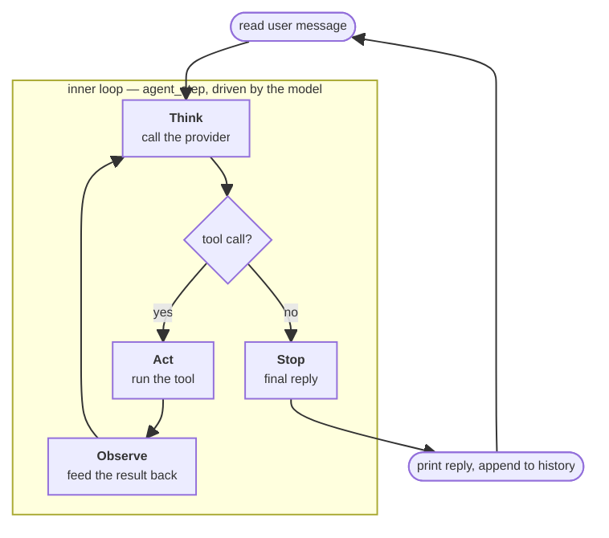
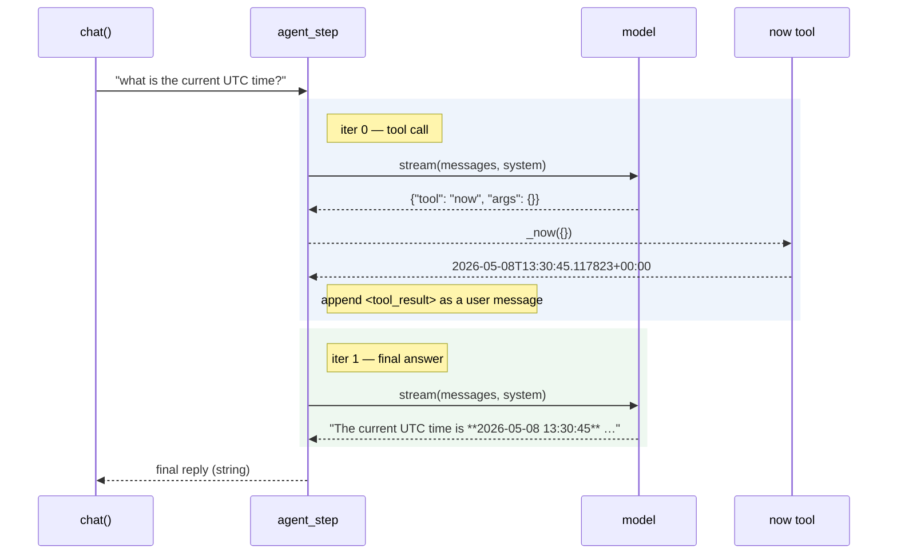
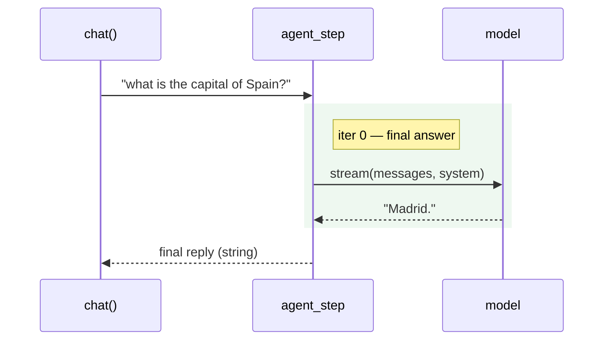

# Chapter 6: The Loop

By now, `chat()` could take a `Provider`, stream text, and stay alive across outages with a `FallbackProvider`. Every user message still produced exactly one reply.

This chapter introduces an _agent loop_: an inner loop that lets a single user message drive many model calls, including thinking, tool calls, observation of results, and a final reply, until the agent reaches the goal. Native tool-call APIs wait until Chapter 7. Here the model emits tool requests in a tiny JSON wire format, and the loop parses each reply, runs the tool, feeds the result back, and iterates.

## The shape of the inner loop

Through Chapter 5 the agent ran a single loop: `chat()` read a line, called the provider once, printed the reply, and looped back for the next line, reasulting in one user message and one model call. This chapter nests a second loop called `agent_step()` inside that one.



Here is that inner loop in pseudocode:

```python
def agent_step(messages):
    while True:
        reply = think(messages)
        if reply.is_final_text:
            return reply.text
        messages.append(reply.assistant_message)
        result = act(reply.tool_request)
        messages.append(result.observation)
```

Every iteration runs the same four moments — the _reason, act, observe_ cycle the ReAct paper [1] introduced for getting tool use out of an unmodified model:

- _Think._ The model sees the current state of the conversation and produces output — either a final reply or a tool call. That output is appended to the message history.
- _Act._ If the model asked for a tool call, the loop runs the tool with the requested arguments.
- _Observe._ The result of running the tool becomes a new message in the conversation. The model will see it on the next iteration.
- _Stop._ When the model produces a final reply with no tool call, the loop returns.

## Picking a wire format

All modern providers support tool calls as a first-class field in their request and response shapes(Anthropic [2], OpenAI [3], and Google [4] each have their own variant). The model emits a structured tool call in its own slot (separate from text), the runtime executes the tool, and the result returns in another structured slot on the next request. Chapter 7 wires the agent up to those native APIs.

This chapter takes a simpler route. The 2022 ReAct paper [1] showed that an unmodified model can be driven to reason and act just by labelling its output (`Thought:` / `Action:` / `Observation:`) and feeding the results back. A careful system prompt and a small parser are enough to teach an off-the-shelf model to use tools, with no provider API and no fine-tuning. Doing it by hand is also the pedagogical point: it keeps every moving part visible until Chapter 7 hides them behind a structured API.

The format is a JSON structured like this:

```
{"tool": "now", "args": {}}
```

When the model emits a reply that is a JSON line of this shape, the loop treats it as a tool call. When the model emits anything else, the loop treats it as the final answer.

One thing to notice here though is that the provider streams text deltas, but the loop cannot decide whether a reply is a tool call or a final answer until all of it has arrived. So the loop collects each reply in full and only `print()`s it after the iteration ends. Streaming returns in Chapter 7, when native tool calls let the provider emit text deltas independently of tool-call deltas.

## The first tool

To start, define a `now` tool in `agent/loop.py` that returns the current time in ISO format:

```python
from datetime import datetime, timezone


def _now(args: dict) -> str:
    return datetime.now(timezone.utc).isoformat()


TOOLS = {
    "now": _now,
}
```

The function is then registered in `TOOLS` under a distinct name. The model will only ever see that name in the wire format. Each tool takes a dict of arguments and returns a string that the model will see as the observation on the next iteration.

## Telling the model how to talk

The model has to know which tools exist and what wire format is expected. This information goes into the system prompt. Continuing in `loop.py`, add an instructions string and a small builder that splices it onto whatever `build_context()` already produces:

```python
from context import build_context


TOOL_INSTRUCTIONS = """
You have access to tools. To call a tool, reply with exactly one line of JSON:

    {"tool": "<name>", "args": {<arguments>}}

Available tools:

- `now` — return the current UTC time. No arguments.

When you call a tool, do not write anything else. Wait for the tool result, then continue.
When you have nothing left to do, reply with a normal text answer to the user. No JSON.
""".strip()


def build_agent_system() -> str:
    return f"{build_context()}\n\n{TOOL_INSTRUCTIONS}"
```

Look closely at the body of `build_agent_system`: it calls `build_context()` from Chapter 5, then appends `TOOL_INSTRUCTIONS` on the end. The whole protocol lives in plain English in the system prompt. Anthropic's _Building effective agents_ surveys this style of construction across a wide range of agentic patterns [5].

## Parsing the model's reply

The next step is to decide whether a model reply is a tool call or a final answer. Tool calls are supposed to be a single line of JSON, so a small helper in `loop.py` is enough:

```python
import json


def _parse_tool_call(text: str) -> dict | None:
    text = text.strip()
    if not text.startswith("{"):
        return None
    try:
        parsed = json.loads(text)
    except json.JSONDecodeError:
        return None
    if not isinstance(parsed, dict) or "tool" not in parsed:
        return None
    return parsed
```

Three failure modes are tolerated by returning `None`: the reply does not start with `{` (it is plain text), the reply is not valid JSON (the model improvised), or the JSON is valid but has the wrong shape. Any of these means "treat the reply as a final answer." and a model that ignores the protocol still produces a useful chat experience, although it cannot use tools.

## Combine everything into the loop

Now the registry, the system prompt, and the parser get wired into the actual loop.

Start with the bare iteration shell. It calls the provider, collects the reply, parses it, and either returns the reply as a final answer or keeps going:

```python
from providers.base import Provider


MAX_ITERATIONS = 10


def agent_step(
    user_message: str,
    history: list[dict],
    provider: Provider,
    system: str,
) -> str:
    messages = list(history)
    messages.append({"role": "user", "content": user_message})

    for _ in range(MAX_ITERATIONS):
        reply = "".join(provider.stream(messages, system=system))
        call = _parse_tool_call(reply)
        if call is None:
            return reply

    return "I exceeded the maximum number of steps without producing a final answer."
```

`messages = list(history)` makes a shallow copy of the conversation. The agent loop is about to accumulate internal turns — the assistant's tool-call requests, the synthetic tool-result messages, the model's reactions — and whether any of that should persist back to `chat()`'s long-term history is still undecided. Copying leaves room to decide later. For this chapter only the final assistant text is kept.

`"".join(provider.stream(...))` accumulates the full reply before anything inspects it. Streaming is gone for the duration of the loop, as promised in _Picking a wire format_ section: the loop cannot decide whether a reply is a tool call or a final answer until all of it has arrived.

`MAX_ITERATIONS = 10` is a hard cap so a runaway model cannot run forever. If the loop hits it, the agent surrenders with an apologetic string. Chapter 9 builds the real version, with stop reasons and a cleaner failure message.

So far the shell handles final answers but does nothing useful with tool calls — when `call is not None`, the loop iterates with an unchanged `messages` and eventually gives up. The next step is dispatching the tool. Replace the body of the `for` loop with this:

```python
for _ in range(MAX_ITERATIONS):
    reply = "".join(provider.stream(messages, system=system))
    call = _parse_tool_call(reply)

    if call is None:
        return reply

    # --- new: everything below dispatches the tool the model asked for ---
    tool_name = call["tool"]
    tool_args = call.get("args") or {}            # default to {} when no args are sent
    tool = TOOLS.get(tool_name)
    if tool is None:
        # unknown tool name: feed the error back as an observation, don't crash
        observation = f"Error: no tool named {tool_name!r}."
    else:
        try:
            observation = tool(tool_args)
        except Exception as exc:
            # the tool raised: same treatment — the exception becomes an observation
            observation = f"Error: {type(exc).__name__}: {exc}"
```

Raising on either failure would terminate the whole turn for what is often a one-line typo in the model's JSON. Folding both into an `observation` string keeps the turn alive: the error is fed back on the next iteration, where the model can read it, change its mind, and try a different tool or just answer in plain text.

The dispatch produces an observation but never writes it anywhere, so the next provider call would not see it. The last step is closing that gap. At the end of the loop body, append two messages — the assistant's tool-call reply and the synthetic tool result — then let the iteration fall through:

```python
    if tool is None:
        # unknown tool name: feed the error back as an observation, don't crash
        observation = f"Error: no tool named {tool_name!r}."
    else:
        try:
            observation = tool(tool_args)
        except Exception as exc:
            observation = f"Error: {type(exc).__name__}: {exc}"

    # --- new ---
    messages.append({"role": "assistant",   "content": reply})
    messages.append({
        "role": "user",
        "content": f"<tool_result tool={tool_name}>\n{observation}\n</tool_result>",
    })
```

The resulting `agent_step()` is enough to make the agent work, but from `chat()`'s point of view, every turn produces exactly one string, and the model's intermediate decisions — its tool calls, its reactions to observations — are invisible. The rest of this chapter needs to see those intermediate steps, so add one last debugging line to the loop body. Rename the loop variable from `_` to `i` to make the iteration count available, and `print` each reply as it comes in:

```python
for i in range(MAX_ITERATIONS):
    reply = "".join(provider.stream(messages, system=system))
    print(f"[iter {i}] reply={reply[:120]!r}")
    call = _parse_tool_call(reply)
    # ... rest of the loop unchanged
```

## Wiring `chat()` to the loop

The two-loop split sketched at the start of the chapter now has to land in code, across two files: `chat()` stays the outer loop in `agent/main.py`, and `agent_step`, the function just built, becomes the inner loop in `agent/loop.py`.

The user-input handling stays as-is. The streaming-and-append block in the middle, which used to be the model loop, collapses into a single call to `agent_step`. The system-prompt builder also has to change, since the model now needs the tool protocol on top of the persona and instructions. The result:

```python
from loop import agent_step, build_agent_system


def chat(provider: Provider | None = None) -> None:
    """Run an interactive chat loop, dispatching each user turn to the agent loop."""
    if provider is None:
        provider = DEFAULT_PROVIDER

    system = build_agent_system()  # <-- was build_context(); now appends the tool protocol
    messages: list[dict] = []
    print("chat — Ctrl-D or empty line to exit\n")
    while True:
        try:
            user_input = input("you: ").strip()
        except (EOFError, KeyboardInterrupt):
            print()
            break
        if not user_input:
            break

        reply = agent_step(user_input, messages, provider, system)  # <-- was the streaming model loop
        print(f"\nassistant: {reply}\n")
        messages.append({"role": "user", "content": user_input})
        messages.append({"role": "assistant", "content": reply})
```

## A worked example

Run `uv run main.py` and ask for the time:

```
chat — Ctrl-D or empty line to exit

you: what is the current UTC time, to the second?
[iter 0] reply='\n\n{"tool": "now", "args": {}}'
[iter 1] reply='The current UTC time is **2026-05-08 13:30:45** (Friday, May 8, 2026).'

assistant: The current UTC time is **2026-05-08 13:30:45** (Friday, May 8, 2026).

you: ^D
```

The bare `assistant:` line at the bottom is what `chat()` prints; everything between it and the user prompt is the debug trace from `agent_step`, exposing the inner loop. Laid out as a sequence of messages, the two iterations look like this — the dashed step in the middle is the tool dispatch the trace never shows:



The first iteration is the tool call. The model decided the question needed real-time information and emitted `{"tool": "now", "args": {}}`. One detail is worth pausing on: the reply actually begins with `\n\n` — two blank lines the model added in front of its JSON the way it might in front of a normal paragraph. That is exactly the kind of incidental noise that motivates the `text.strip()` at the top of `_parse_tool_call`. Without it, the parser would reject this perfectly valid tool call because the raw string does not start with `{`.

Between the two iterations, work happens that the trace does not show: the loop called `_now`, got back something like `2026-05-08T13:30:45.117823+00:00`, wrapped it in a `<tool_result>` block, and appended it as a synthetic user message. The debug line prints only the model's output, so the tool result itself is invisible from this trace alone, even though it is the load-bearing thing that lets iteration 1 produce a coherent answer.

The second iteration is the final answer. The model saw the tool result and produced natural language. The reply contains no JSON, so `_parse_tool_call` returns `None`, `agent_step` returns the string, and the turn ends. Notice what the model did with the raw ISO timestamp it received: it dropped the timezone suffix, dropped the microseconds (despite "to the second" arguably calling for them), added the day of the week, and wrapped the time in markdown bold. The model owns the shape of the answer — `_now` returns one canonical string, and every model is free to render it differently.

Now ask a question that does not require the tool:

```
you: what is the capital of Spain?
[iter 0] reply='Madrid.'

assistant: Madrid.
```

This time the loop runs exactly once. The model decided no tool was needed, the parser saw plain text and returned `None`, and `agent_step` returned on the very first pass. The same sequence collapses to a single round trip, with no tool and no second iteration:



## Production reference

The production version of this `agent_step` lives in [nanobot/nanobot/agent/runner.py](https://github.com/HKUDS/nanobot/blob/28f9bbff314cf90b0401b3aa220ca7a723c4f4ab/nanobot/agent/runner.py). The entry point is [`AgentRunner.run`](https://github.com/HKUDS/nanobot/blob/28f9bbff314cf90b0401b3aa220ca7a723c4f4ab/nanobot/agent/runner.py#L231), an `async` method that drives one user turn through provider calls, tool dispatch, and termination. The skeleton is recognisable from the chapter's version: a `for iteration in range(spec.max_iterations)` over a model call, followed by either tool execution or termination. The interesting differences are in everything around that core. Three of them shape how the rest of the book treats the loop.

First of all, a pipeline of message-list governance runs before every model call. The toy `agent_step` passes `messages` straight to the provider. `AgentRunner.run` instead builds a separate `messages_for_model` list each iteration and runs it through a chain of repairs: [`_drop_orphan_tool_results`](https://github.com/HKUDS/nanobot/blob/28f9bbff314cf90b0401b3aa220ca7a723c4f4ab/nanobot/agent/runner.py#L912) removes `tool_result` blocks whose matching `tool_use` is gone, [`_backfill_missing_tool_results`](https://github.com/HKUDS/nanobot/blob/28f9bbff314cf90b0401b3aa220ca7a723c4f4ab/nanobot/agent/runner.py#L938) inserts the placeholders the other way around, [`_microcompact`](https://github.com/HKUDS/nanobot/blob/28f9bbff314cf90b0401b3aa220ca7a723c4f4ab/nanobot/agent/runner.py#L979) summarises old turns when the conversation is getting long, [`_apply_tool_result_budget`](https://github.com/HKUDS/nanobot/blob/28f9bbff314cf90b0401b3aa220ca7a723c4f4ab/nanobot/agent/runner.py#L1004) caps how much room any single tool result can take, and [`_snip_history`](https://github.com/HKUDS/nanobot/blob/28f9bbff314cf90b0401b3aa220ca7a723c4f4ab/nanobot/agent/runner.py#L1025) trims the front of the conversation. Anthropic in particular rejects a `tool_result` that has no matching `tool_use` earlier in the list, so the orphan-cleanup step is not optional in production.

Nanobot also has per-iteration checkpointing. [`_emit_checkpoint`](https://github.com/HKUDS/nanobot/blob/28f9bbff314cf90b0401b3aa220ca7a723c4f4ab/nanobot/agent/runner.py#L853) fires at two points inside `AgentRunner.run` — after the model emits tool calls (`phase: awaiting_tools`) and after the tools complete (`phase: tools_completed`). The checkpoint goes to session metadata, so if the process is killed mid-tool, the next run can restore the partial state and continue from there. This matters for tool calls that have already done work in the world. The toy `agent_step` has no such recovery path because every tool here is in-process and idempotent.

Finallty, both `AgentRunner.run` and [`_execute_tools`](https://github.com/HKUDS/nanobot/blob/28f9bbff314cf90b0401b3aa220ca7a723c4f4ab/nanobot/agent/runner.py#L695) are `async`. Production agents have to hand control back to the event loop while a tool runs (HTTP requests, subprocesses, model calls), so the whole runner is built around `await` rather than around blocking calls. Tools themselves are dispatched through [`_run_tool`](https://github.com/HKUDS/nanobot/blob/28f9bbff314cf90b0401b3aa220ca7a723c4f4ab/nanobot/agent/runner.py#L731), which can run several tools concurrently when the model asks for them in a single turn. 

## Exercises

1. **Add a second tool.** Extend `TOOLS` with `wordcount`: takes `{"text": "..."}` and returns the number of whitespace-separated words. Update `TOOL_INSTRUCTIONS` so the model knows about it. Test that the model picks the right tool for "how many words are in 'the quick brown fox'?" and not for "what is the time?". Adding a tool should require no changes to `agent_step` at all — that is the abstraction's payoff.

2. **Iteration trace.** Promote the debug `print` added to `agent_step` into a proper `verbose` argument. When `verbose=True`, print a one-line summary of each iteration — the iteration number, which tool was called with what args, and the observation truncated to 80 characters. When `verbose=False`, the function should print nothing at all. Use it to watch a multi-step turn and confirm the model is actually looping.

3. **Stricter parser.** The current parser silently treats malformed JSON as a final answer — convenient when the model improvises, dangerous when it produces a malformed tool call that was genuinely meant to be a tool call. Change the wire format to require a sentinel: tool calls must start with the literal token `TOOL:` on a line by itself, followed by JSON. Anything else is a final answer. Run a few prompts and judge which failure mode is worse in practice — false positives (treating a malformed tool call as text) or false negatives (treating prose with a stray `{` as a tool call).

4. **Idempotent tools and re-runs.** Replace `now` with a `roll_d20` tool that returns a random integer 1–20. Ask the model to roll three times and report the sum. Watch what the loop does. Then reason about it: what does "tool result" mean when the tool is non-deterministic, and why does this matter for the kind of checkpointing nanobot does (production reference, point two)?

5. **Stretch: orphan tool results.** Open [`nanobot/nanobot/agent/runner.py`](https://github.com/HKUDS/nanobot/blob/28f9bbff314cf90b0401b3aa220ca7a723c4f4ab/nanobot/agent/runner.py) and find [`_drop_orphan_tool_results`](https://github.com/HKUDS/nanobot/blob/28f9bbff314cf90b0401b3aa220ca7a723c4f4ab/nanobot/agent/runner.py#L912). Read it carefully and explain in two sentences what an orphan tool result is and why it must be removed before the next model call. Hint: provider validation rules — Anthropic in particular rejects a `tool_result` block without a matching `tool_use` block earlier in the conversation. Construct a small example by hand (no code needed) where this happens.

6. **Stretch: persist the scratchpad.** Change `agent_step` to _return_ the full message list it built — every assistant tool-call message, every synthetic tool-result user message — and change `chat()` to extend its long-term `messages` with the whole thing instead of just the final reply. Run two short sessions and `print(len(messages))` after each user turn:
   - Session A: "what is the current UTC time?" then "and what about now, ten seconds later?"
   - Session B: "what is the current UTC time?" then "tell me a joke."

   Compare the two lengths and the model's second reply in each case. In which session does the persisted scratchpad actually inform the next turn's reply? In which is it dead weight? Then open [`nanobot/nanobot/agent/autocompact.py`](https://github.com/HKUDS/nanobot/blob/28f9bbff314cf90b0401b3aa220ca7a723c4f4ab/nanobot/agent/autocompact.py) and find [`prepare_session`](https://github.com/HKUDS/nanobot/blob/28f9bbff314cf90b0401b3aa220ca7a723c4f4ab/nanobot/agent/autocompact.py#L109) — that is where the production answer to the same trade-off lives, made automatic via summarization.

## References

[1] Shunyu Yao et al. _ReAct: Synergizing Reasoning and Acting in Language Models._ arXiv:2210.03629, 2022. <https://arxiv.org/abs/2210.03629>

[2] _Tool use with Claude._ Claude API documentation. <https://platform.claude.com/docs/en/build-with-claude/tool-use>

[3] _Function calling._ OpenAI API documentation. <https://platform.openai.com/docs/guides/function-calling>

[4] _Function calling with the Gemini API._ Google AI for Developers. <https://ai.google.dev/gemini-api/docs/function-calling>

[5] _Building effective agents._ Anthropic Engineering, 2024-12-19. <https://www.anthropic.com/engineering/building-effective-agents>
