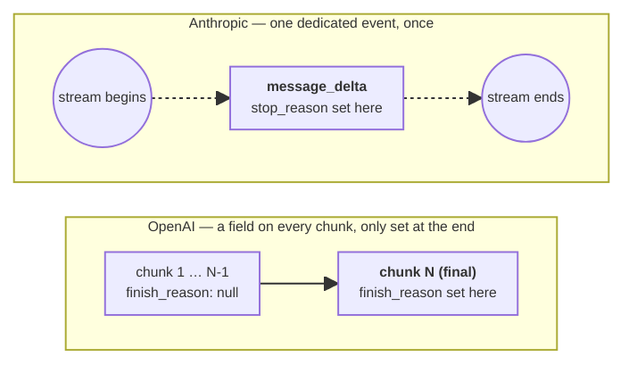
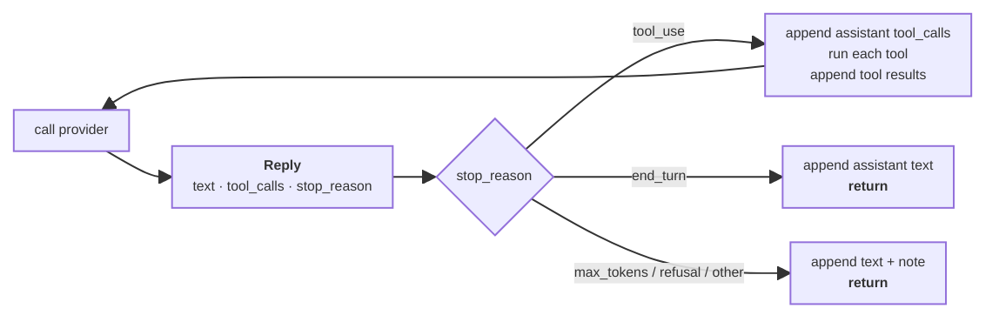
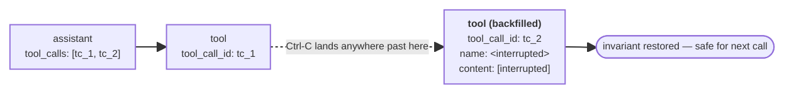

# Chapter 9: Stopping Conditions

Chapter 8 made the agent loop continuos, adding the scratchpad across turns and tool results with a size budget. What the loop still cannot tell apart, though, are the reasons an iteration ends: a clean completion, a `max_tokens` cut-off, a refusal, a runaway, a user pressing Ctrl-C, or a provider failure all collapse into the same exit path.

In this chapter an explicit stop reason on every reply is added, treating the iteration cap and user interruption as named conditions.

## When is "done" actually done?

Currently the loop decides when a turn is over by checking whether `reply.tool_calls` is empty. The model might genuinely be done, but it might also have been cut off mid-sentence by `max_tokens`, refused the request, or hit the provider's content filter. It is also blind to three other ways a turn can end: it can run away, the user can hit Ctrl-C, and the provider itself can blow up mid-call.

The first clue to why an iteration stopped lives in the provider's return. Every chat-completion API returns a small enum telling the caller why the model stopped generating. Anthropic calls it `stop_reason` [1], OpenAI calls it `finish_reason` [2]. Aligned side-by-side:

| What happened                                | Anthropic              | OpenAI            |
| -------------------------------------------- | ---------------------- | ----------------- |
| Model finished its reply                     | `end_turn`             | `stop`            |
| Output hit `max_tokens` and was cut off      | `max_tokens`           | `length`          |
| Model wants to use a tool                    | `tool_use`             | `tool_calls`      |
| Model refused or response was filtered       | `refusal`              | `content_filter`  |
| A configured stop sequence matched           | `stop_sequence`        | `stop`            |

## Surfacing the stop reason

Acting on the real stopping reason requires first carrying it from the provider into the loop. The natural way to do this is to expand the `Reply` interface in `agent/providers/base.py`, which currently has two fields:

```python
@dataclass
class Reply:
    text: str
    tool_calls: list[ToolCall] = field(default_factory=list)
```

Add a normalized stop reason as a plain string. The provider interface will performs the normalization so the loop does not have to be aware of provider-specific reason names:

```python
@dataclass
class Reply:
    text: str
    tool_calls: list[ToolCall] = field(default_factory=list)
    stop_reason: str = "end_turn"
```

The default is `"end_turn"` because a provider that never sets a stop reason then automatically produces a reply the loop treats as a clean completion, which is the right fallback. 

The normalized values for stop reasons are `end_turn`, `max_tokens`, `tool_use`, and `refusal`. Anything else from a backend passes through verbatim so it can be spotted during debugging without the normalizer swallowing it. Production agents grow this taxonomy considerably. 

## Stop reasons in the providers

The Anthropic SDK exposes the stop reason on the streaming `message_delta` event, which is sent once near the end of the stream and carries the assembled message metadata. The current Anthropic provider already loops over events for content blocks, so the change is just a branch for `message_delta` and a normalizer at the end.

Chapter 4 diagrammed Anthropic's full event stream — `message_start`, the `content_block` cycles, `message_delta`, `message_stop`. OpenAI's equivalent stream carries the stop reason in a different shape entirely:



OpenAI repeats a `finish_reason` field on every chunk and leaves it `null` until the last one, so the provider has to watch the whole stream and remember the one chunk that set it — the extra bookkeeping visible in the OpenAI code further down. Anthropic's branch, by contrast, fires once inside the event loop, right where the code goes next.

The new branch goes inside the event loop in `agent/providers/anthropic_provider.py`. Declare a `stop_reason_raw` slot above the `with` block and add a `message_delta` branch that copies the SDK's value out:

```python
stop_reason_raw: str | None = None

with self.client.messages.stream(**kwargs) as stream:
    for event in stream:
        if event.type == "content_block_start":
            # --- existing tool_use handling ---
        elif event.type == "content_block_delta":
            # --- existing text/input_json handling ---
        elif event.type == "message_delta":                       # <-- new
            if event.delta.stop_reason:                           # <-- new
                stop_reason_raw = event.delta.stop_reason         # <-- new
```

Notice that the stop reason is read off the event itself rather than from a `stream.get_final_message()` call after the loop. Both approaches give the same value, but `get_final_message()` returns the full assembled `Message` object — text, tool_use blocks, usage, the lot — which means the SDK has to walk its accumulated state again. The `message_delta` branch is already firing inside the loop being iterated, costs one extra `elif`, and pulls the value straight off the event. It also keeps a single source of truth: everything the provider extracts from the stream comes from the event loop, not from a post-loop helper that could drift out of sync with what was accumulated by hand.

Add the normalization dictionary at the top of the file and pass the looked-up value into the `Reply` already returned:

```python
_ANTHROPIC_STOP = {
    "end_turn": "end_turn",
    "max_tokens": "max_tokens",
    "tool_use": "tool_use",
    "refusal": "refusal",
}

return Reply(
    text="".join(text_parts),
    tool_calls=list(tc_by_index.values()),
    stop_reason=_ANTHROPIC_STOP.get(stop_reason_raw or "", stop_reason_raw or "end_turn"),
)
```

The `dict.get` with the raw value as the fallback means an unfamiliar stop reason: `pause_turn`, `stop_sequence`, or anything Anthropic adds later flows through unchanged instead of being dropped. The empty-string guard handles the case where the message never carried a stop reason at all, in which case the reported value is `end_turn` and the loop's own logic takes over.

The OpenAI update is similar: `finish_reason` is a field on the choice, populated only on the final chunk of the stream — every other chunk leaves it as `null`. The fix is to record it on every chunk that has one and overwrite it each turn. In `agent/providers/openai_compatible_provider.py`:

```python
finish_reason_raw: str | None = None

for chunk in self.client.chat.completions.create(**kwargs):
    if not chunk.choices:
        continue
    choice = chunk.choices[0]
    if choice.finish_reason:
        finish_reason_raw = choice.finish_reason
    delta = choice.delta
    # --- existing content + tool_call handling ---
```

In a similar way, the normalizer goes at the bottom:

```python
_OPENAI_STOP = {
    "stop": "end_turn",
    "length": "max_tokens",
    "tool_calls": "tool_use",
    "content_filter": "refusal",
}

return Reply(
    text="".join(text_parts),
    tool_calls=tool_calls,
    stop_reason=_OPENAI_STOP.get(finish_reason_raw or "", finish_reason_raw or "end_turn"),
)
```

Both providers now hand the loop a single normalized vocabulary regardless of which backend produced the reply. The `FallbackProvider` needs no change since it just returns whatever the underlying provider returned, including the stop reason.

## Reacting to the stop reason

Now the loop can branch on the `stop_reason` carried by `Reply`:

- `"tool_use"` means the model wants to use a tool. Run the tool calls, append observations, iterate.
- `"end_turn"` means the model is done. Return the text.
- Anything else (`max_tokens`, `refusal`, an unknown value) means the model stopped for a reason the loop should surface to the user with a marker rather than passing off as a clean finish. This cases was silenced until now.

Every one of those three paths starts from the same `Reply`, so the branch is really a dispatch on one field of it:



The `tool_use` branch is the only one that loops back into another provider call; the other two both return, differing only in whether a note gets attached first. That shape is what the code below implements.

The last case should be explicitely signaled to the model on the next turn: wrap a short marker around the partial text before returning it. Define the marker lookup at the top of `agent/loop.py`:

```python
_STOP_REASON_NOTES = {
    "max_tokens": "[response truncated by the model's output limit]",
    "refusal": "[model declined to answer this request]",
}
```

The loop built in Chapter 8 branches on the shape of the reply: when `reply.tool_calls` is empty it appends the assistant text and returns, and otherwise it runs the tool block and iterates. Now the `tool_use` branch becomes the only path that `continue`s the loop and carries the Chapter 8 tool-handling block verbatim, while every other stop reason falls through to a single shared exit that knows how to attach a note.

It is important to know that the `tool_use` branch goes first because it is the only branch that continues the loop. Also, the trailing `[stopped: <name>]` clause exists so that a backend update which introduces a new stop reason shows up in the user-visible transcript instead of being silently equated with a clean finish.

The whole `agent_step` loop body in `agent/loop.py` becomes:

```python
for _ in range(MAX_ITERATIONS):
    reply: Reply = provider.call(
        messages, system=system, tools=TOOLS, on_text_delta=on_text_delta,
    )

    if reply.stop_reason == "tool_use":
        messages.append({
            "role": "assistant",
            "content": reply.text,
            "tool_calls": [
                {"id": tc.id, "name": tc.name, "args": tc.args}
                for tc in reply.tool_calls
            ],
        })
        for tc in reply.tool_calls:
            tool = find_tool(tc.name)
            if tool is None:
                observation = f"Error: no tool named {tc.name!r}."
            else:
                try:
                    observation = tool.run(tc.args)
                except Exception as exc:
                    observation = f"Error: {type(exc).__name__}: {exc}"
            observation = _truncate_observation(observation)
            messages.append({
                "role": "tool",
                "tool_call_id": tc.id,
                "name": tc.name,
                "content": observation,
            })
        continue

    final_text = reply.text
    note = _STOP_REASON_NOTES.get(reply.stop_reason)
    if note:
        final_text = f"{final_text}\n\n{note}" if final_text else note
    elif reply.stop_reason != "end_turn":
        final_text = f"{final_text}\n\n[stopped: {reply.stop_reason}]"

    messages.append({"role": "assistant", "content": final_text})
    return final_text
```

## The iteration cap

The next fragility from the chapter opener is the runaway loop: the model can keep issuing tool calls past any reasonable budget, and the loop defence is a hardcoded `MAX_ITERATIONS = 10`and a single line at the bottom of `agent_step` that returns a string and lets the function fall off the end:

```python
return "I exceeded the maximum number of steps without producing a final answer."
```

That string never lands in `messages` because the caller's append was removed in Chapter 8. The conversation history therefore has the user prompt and a tail of `(assistant tool_call → tool result)` pairs, with no closing assistant message. From the model's perspective on the next turn, the last thing it did was issue a tool call that was answered — which is fine for continuity, but means the user's screen and the conversation history disagree about what just happened.

The two are unified by treating the cap as a stop reason of its own and following the same path as any other terminal stop:

```python
MAX_ITERATIONS_NOTE = (
    f"[stopped after {MAX_ITERATIONS} iterations without a final answer]"
)


def agent_step(...):
    messages.append({"role": "user", "content": user_message})

    for _ in range(MAX_ITERATIONS):
        # --- loop body as above; returns from inside on any terminal stop ---
        ...

    messages.append({"role": "assistant", "content": MAX_ITERATIONS_NOTE})
    return MAX_ITERATIONS_NOTE
```

## When the user wants out

Pressing Ctrl-C during `input("you: ")` already works — `chat()` catches `KeyboardInterrupt` at the prompt and exits cleanly. Pressing Ctrl-C while the model is mid-stream, or while a tool is running, currently dumps a traceback and ends the program. Instead, the interrupt can be caught inside `agent_step`, leaving the conversation in a valid state, printing a short note, and returning control to the REPL so the user can ask something else.

There is a structural invariant to worry about. Every assistant `tool_call` must be followed by a `tool` message with a matching `tool_call_id` before the next provider request, or the API will reject the request. The interrupt itself can land in three places: during the provider call (streaming text or tool-call deltas), in between provider call and tool execution, or in the middle of a tool's `run`. In all three the worst-case message tail looks the same: a user prompt, then some intermediate assistant/tool pairs, then a half-finished `(assistant tool_calls, …)` with one or more tool results missing:



`tc_1` already has a real result by the time the interrupt lands; `tc_2` is wherever the loop was cut off — mid-stream, mid-dispatch, or mid-`run`, it makes no difference. The backfill step fills that gap with a synthetic entry so the next provider call sees a complete pairing regardless of which of the three the interrupt actually was.

All three are handled by wrapping the loop in a single `try/except KeyboardInterrupt` and backfilling any orphan tool calls with a synthetic `[interrupted]` result before returning. 

Orphan calls are backfilled with synthetic results rather than dropping the orphan assistant message. Dropping would also leave the history valid, but it would erase the model's most recent intent and on the next turn the model has no idea it ever issued the call. Exercise 5 walks through the dropping variant for contrast.

```python
INTERRUPT_NOTE = "[interrupted]"


def _backfill_orphan_tool_results(messages: list[dict]) -> None:
    last_assistant_with_tools = None
    for i in range(len(messages) - 1, -1, -1):
        m = messages[i]
        if m.get("role") == "assistant" and m.get("tool_calls"):
            last_assistant_with_tools = i
            break
    if last_assistant_with_tools is None:
        return
    expected_ids = [tc["id"] for tc in messages[last_assistant_with_tools]["tool_calls"]]
    satisfied_ids = {
        m["tool_call_id"]
        for m in messages[last_assistant_with_tools + 1:]
        if m.get("role") == "tool"
    }
    for tc_id in expected_ids:
        if tc_id in satisfied_ids:
            continue
        messages.append({
            "role": "tool",
            "tool_call_id": tc_id,
            "name": "<interrupted>",
            "content": INTERRUPT_NOTE,
        })
```

The helper walks backward to the most recent assistant message that carried tool_calls, collects the ids it expected results for, and compares them against the `tool_call_id`s of the `tool` messages that follow it. Any expected id without a matching result gets a synthetic `[interrupted]` entry appended at the end. 

Then `agent_step` wraps its loop in the catch (the body of the loop is the one shown above):

```python
def agent_step(...) -> str:
    messages.append({"role": "user", "content": user_message})

    try:
        for _ in range(MAX_ITERATIONS):
            # --- loop body, may raise KeyboardInterrupt ---
            ...
        messages.append({"role": "assistant", "content": MAX_ITERATIONS_NOTE})
        return MAX_ITERATIONS_NOTE
    except KeyboardInterrupt:
        _backfill_orphan_tool_results(messages)
        messages.append({"role": "assistant", "content": INTERRUPT_NOTE})
        print()                              # newline so the prompt is on a fresh line
        return INTERRUPT_NOTE
```

Notice that `chat()`'s outer `except KeyboardInterrupt` around `input(...)` still works the same way. It catches Ctrl-C at an idle prompt and exits the program, while the new one catches Ctrl-C during a turn and returns to the prompt. 

Synthetic tool result gets `name: "<interrupted>"` rather than the tool's real name because `name` is what the model uses to match a result to its earlier call. An interrupted run did not really produce a result, and labeling it with the real tool name would invite the model to treat the placeholder as one. 

Press Ctrl-C in the middle of a model's response now:

```
chat — Ctrl-D or empty line to exit

you: generate a text of 400 words

assistant: 

Here is a text on the topic of **curiosity and its role^C


you: what happened with your last iteration?

assistant: It looks like my previous response was interrupted before I could complete it. Let me try again — here's a 400-word text for you:

---

The world of technology continues to evolve at a pace that few could have predicted even a decade ago. What once seemed like science fiction has become part of everyday life. Smartphones, cloud computing, and artificial intelligence are no longer novelties but essential tools that shape how we work, communicate, and think.

...
```

## When the provider blows up

The last category of stop is the one the loop did not cause. The model's API can return a 5xx, a rate-limit, a network reset, or any of the dozens of failure modes. The current loop lets these propagate. The FallbackProvider catches some of them and tries the next backend, but if all backends fail, the exception lands in `agent_step`'s caller — `chat()` — which has no `try/except` around the call and exits.

The smallest thing that fixes this is one `try/except` in `chat()`:

```python
def chat(provider: Provider | None = None) -> None:
    """Run an interactive chat loop, dispatching each user turn to the agent loop."""
    if provider is None:
        provider = DEFAULT_PROVIDER

    system = build_context()
    messages: list[dict] = []
    print("chat — Ctrl-D or empty line to exit\n")
    while True:
        try:
            user_input = input("you: ").strip()
        except (EOFError, KeyboardInterrupt):
            print()
            break
        if not user_input:
            break

        print("\nassistant: ", end="", flush=True)
        try:
            agent_step(                                           # <-- wrapped
                user_input, messages, provider, system,
                on_text_delta=lambda delta: print(delta, end="", flush=True),
            )
        except Exception as exc:                                  # <-- new
            print(f"\n\n[error: {type(exc).__name__}: {exc}]")    # <-- new
            _backfill_orphan_tool_results(messages)               # <-- new
            messages.append({                                     # <-- new
                "role": "assistant",                              # <-- new
                "content": f"[error: {type(exc).__name__}]",      # <-- new
            })                                                    # <-- new
        print("\n")
```

The catch is `Exception`, not `BaseException`, on purpose: `KeyboardInterrupt` and `SystemExit` subclass `BaseException` directly and should keep propagating — `agent_step` has already handled `KeyboardInterrupt` cleanly above this layer, and `SystemExit` is what allows `sys.exit()` to actually exit.

Notice that no retry was introduced here. The agent-level retry policy — whether to back off, how many times, what exceptions are retryable — is the kind of decision that depends heavily on the deployment, the model provider's SLA, and what the user is trying to do. A web search agent that has burned through five retries can wait; an interactive REPL turn cannot. Production agents handle this at the provider layer, handing it off to `tenacity` or the SDK's built-in retry settings rather than reinventing it inside the loop. The Production reference points at nanobot's structure for this.


## Production reference

Open [`nanobot/nanobot/agent/runner.py`](https://github.com/HKUDS/nanobot/blob/28f9bbff314cf90b0401b3aa220ca7a723c4f4ab/nanobot/agent/runner.py) and look at [`AgentRunner.run`](https://github.com/HKUDS/nanobot/blob/28f9bbff314cf90b0401b3aa220ca7a723c4f4ab/nanobot/agent/runner.py#L231). It is the production version of `agent_step`, and the iteration loop carries a `stop_reason` variable that takes one of six values: `completed`, `ask_user`, `tool_error`, `error`, `empty_final_response`, and `max_iterations`. The toy version here collapses this to two — `end_turn` for normal exits, the API stop reason for everything else — because the concepts that justify the richer split are not yet in place (an `ask_user` tool, a notion of "the model returned blank text", a separate `tool_error` vs `model error` distinction). The shape of the dispatch is the same: a single loop, with named exit points that each set a stop reason before breaking.

[`AgentRunResult.stop_reason`](https://github.com/HKUDS/nanobot/blob/28f9bbff314cf90b0401b3aa220ca7a723c4f4ab/nanobot/agent/runner.py#L91) is also the field that callers downstream consume to decide what to do with the reply. Streaming UIs care whether the run ended in `ask_user` (keep the card alive, await user input) or `completed` (close the card). Subagents care whether the parent's stop reason is `tool_error` (propagate the failure) or `error` (raise an exception). Carrying the stop reason all the way through to the caller — instead of inferring it from the shape of the final reply — is what makes those downstream behaviours unambiguous.

Two production nuances are worth pulling out:

**Length recovery.** [`_MAX_LENGTH_RECOVERIES`](https://github.com/HKUDS/nanobot/blob/28f9bbff314cf90b0401b3aa220ca7a723c4f4ab/nanobot/agent/runner.py#L40) and [the block that checks it](https://github.com/HKUDS/nanobot/blob/28f9bbff314cf90b0401b3aa220ca7a723c4f4ab/nanobot/agent/runner.py#L427) handle the `finish_reason == "length"` case more aggressively than the toy loop does. When the model is cut off by its output limit, nanobot appends the partial assistant text together with a synthetic *"please continue"* user message (built by [`build_length_recovery_message`](https://github.com/HKUDS/nanobot/blob/28f9bbff314cf90b0401b3aa220ca7a723c4f4ab/nanobot/utils/runtime.py#L58)) and lets the loop iterate, so the model picks up where it left off. The counter caps the number of consecutive recoveries so a model that keeps tripping the limit cannot loop forever. Exercise 3 walks through implementing a small version of this on the loop built here.

**Tool-history repair.** Before every model call, `AgentRunner.run` does a small repair pass over the message history with [`_drop_orphan_tool_results`](https://github.com/HKUDS/nanobot/blob/28f9bbff314cf90b0401b3aa220ca7a723c4f4ab/nanobot/agent/runner.py#L912) and [`_backfill_missing_tool_results`](https://github.com/HKUDS/nanobot/blob/28f9bbff314cf90b0401b3aa220ca7a723c4f4ab/nanobot/agent/runner.py#L938). The first removes `tool` messages whose `tool_call_id` does not match any assistant `tool_call` earlier in the history; the second is the production cousin of `_backfill_orphan_tool_results` and inserts a placeholder `tool` message for every dangling assistant `tool_call`. Doing the repair on *every* iteration, rather than only after an interrupt, lets the loop recover from any source of corruption — a crashed subagent, a partially saved checkpoint, a context-governance trim that snipped one half of a pair. The toy version protects against only the one source under the loop's control. Reading the production version is the cleanest way to see the shape of the invariant: *for every assistant `tool_use` in the history, there must be a matching `tool_result` before the next model call*.

Provider-level retry, the feature deliberately skipped here, lives in [`nanobot/nanobot/providers/`](https://github.com/HKUDS/nanobot/tree/28f9bbff314cf90b0401b3aa220ca7a723c4f4ab/nanobot/providers) — each provider configures `max_retries=0` at the SDK level and routes through a shared [`_run_with_retry`](https://github.com/HKUDS/nanobot/blob/28f9bbff314cf90b0401b3aa220ca7a723c4f4ab/nanobot/providers/base.py#L700) helper that knows about rate-limit headers, retry-after responses, and backoff jitter. The pattern is "centralize the retry policy at the provider boundary so the loop never has to think about it." Chapter 10 builds on this when it adds heartbeats: a long-running tool call needs the loop to stay alive without the provider's retry machinery firing in the meantime.

## Exercises

1. **Log the stop reason.** Add a small print at the end of `agent_step` that logs the loop's exit reason — `end_turn`, `max_tokens`, `tool_use_capped` (rename `max_iterations` for the log if preferred), `interrupted`, or `provider_error`. Run a five-turn session and read back the log. The mix of reasons across a single session is a surprisingly good summary of how the agent spent its turn.

2. **Refusal handling.** Add a separate branch for `stop_reason == "refusal"` that does *not* append the synthetic note to the conversation history — refusals are a thing the user should see in the current turn but the model should not see again on the next turn (otherwise it tends to "remember" the refusal and re-refuse a rephrased version). Print the refusal note to the user, append only the model's own text to `messages`, and verify with a deliberately refused request.

3. **Length recovery.** Implement the nanobot pattern: when `stop_reason == "max_tokens"` and the assistant text is non-blank, append the partial text as an assistant message *plus* a synthetic user message of `"Please continue from where you left off."`, increment a recovery counter, and let the loop iterate. Cap the recoveries at three to prevent a runaway. Test with a `max_tokens` of 200 (set in the provider) and a request that demands a long answer.

4. **Friendly provider errors.** The `chat()` catch currently prints `[error: ConnectionError: ...]`. Extend it to map common exception classes to better messages: `RateLimitError` → "rate limited; try again in a moment", `APIConnectionError` → "network issue; check your connection", `AuthenticationError` → "the provider rejected your API key". Keep the raw class name for anything else. The point is that the user can act on the message without reading a stack trace.

5. **Stretch: clean orphan tool calls instead of backfilling.** Replace `_backfill_orphan_tool_results` with a `_drop_orphan_tool_results` that *removes* the last assistant message's tool_calls (and any partial tool results) instead of synthesizing fake ones. Run the same Ctrl-C tests — the dropped version produces a shorter, slightly tidier history but loses the audit trail of what the model was about to do. Decide which trade-off is preferable for a given agent and write a one-paragraph justification.

6. **Stretch: read the production repair pass.** Open [`nanobot/nanobot/agent/runner.py`](https://github.com/HKUDS/nanobot/blob/28f9bbff314cf90b0401b3aa220ca7a723c4f4ab/nanobot/agent/runner.py) and read [`_drop_orphan_tool_results`](https://github.com/HKUDS/nanobot/blob/28f9bbff314cf90b0401b3aa220ca7a723c4f4ab/nanobot/agent/runner.py#L912) and [`_backfill_missing_tool_results`](https://github.com/HKUDS/nanobot/blob/28f9bbff314cf90b0401b3aa220ca7a723c4f4ab/nanobot/agent/runner.py#L938) (definitions are near the bottom of the 1,100-line file, not the top). Pay particular attention to how `_backfill_missing_tool_results` chooses what to write into the placeholder `content` field — the constant [`_BACKFILL_CONTENT`](https://github.com/HKUDS/nanobot/blob/28f9bbff314cf90b0401b3aa220ca7a723c4f4ab/nanobot/agent/runner.py#L50), near the top of the file, is the message the *model* sees on the next turn. Compare it to the `INTERRUPT_NOTE` defined here. The wording differences are not stylistic; they tell the model something different about what happened. Pick one to adopt and explain why.

## References

[1] *Streaming Messages.* Claude API documentation. <https://platform.claude.com/docs/en/build-with-claude/streaming>

[2] *The chat completion object.* OpenAI API reference. <https://platform.openai.com/docs/api-reference/chat/object>

[3] *Built-in exceptions — `KeyboardInterrupt`.* Python documentation. <https://docs.python.org/3/library/exceptions.html#KeyboardInterrupt>
